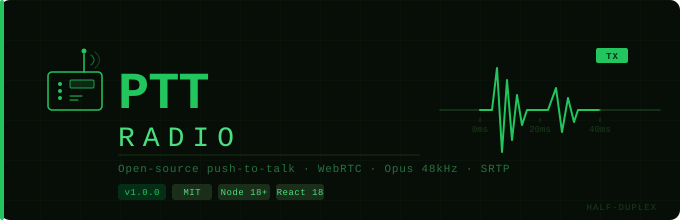

# PTT-Radio
<div align="center">



<br/>
<br/>

[](LICENSE)
[](https://nodejs.org)
[](https://react.dev)
[](https://vitejs.dev)
[](https://webrtc.org)
[](https://opus-codec.org)
[](https://datatracker.ietf.org/doc/html/rfc3711)
[](https://developer.mozilla.org/en-US/docs/Web/API/WebSockets_API)
[](docker-compose.yml)
[](CONTRIBUTING.md)

</div>

---

**Open-source push-to-talk voice communication over WebRTC.**

Hold a button (or keyboard hotkey) to speak. Release to send. Anyone in the same room hears you in real time — no telephony, no audio servers, no third-party services required. Audio travels directly peer-to-peer over encrypted WebRTC (SRTP/Opus), with a tiny WebSocket signaling relay for peer discovery only.

```
  ┌───────── Machine A ──────────┐      ┌───────── Machine B ──────────┐
  │  Browser  →  PTT-Radio UI    │      │    PTT-Radio UI  ←  Browser  │
  │  [HOLD PTT]  Opus 48kHz      │      │     Opus 48kHz  [PLAYS AUDIO]│
  └──────────┬───────────────────┘      └───────────────┬──────────────┘
             │   WebRTC P2P (SRTP/UDP)                  │
             └──────────────────────────────────────────┘
                           ↕ signaling only ↕
                   ┌──────────────────────────┐
                   │   PTT-Radio Signal Server │
                   │   WebSocket — port 3001   │
                   └──────────────────────────┘
```

---

## Features

- **True half-duplex PTT** — hold to transmit, release to end packet
- **WebRTC mesh** — encrypted peer-to-peer audio (SRTP), no audio touches the server
- **Opus codec** — 48 kHz, 20 ms frames, native to all modern browsers, zero WASM
- **Live VU meter** — 24-segment LED-style input level display
- **Oscilloscope waveform ring** — real-time canvas visualization during TX
- **Multi-peer rooms** — up to 8 peers per channel, unlimited channels
- **ICE restart** — automatic reconnection on network changes
- **Demo mode** — works fully offline, no signaling server needed for local testing
- **Rebindable hotkey** — any key, captured live via one-shot listener
- **Persisted settings** — localStorage: server URL, room, hotkey, gain, channel
- **Docker-ready** — multi-stage builds for both client (Nginx) and server (Node)
- **PWA manifest** — installable as a desktop/mobile web app

---

## Directory Structure

```
ptt-radio/
├── package.json               ← root scripts (dev, build, docker)
├── docker-compose.yml         ← full-stack Docker deployment
├── .gitignore
│
├── docs/
│   ├── banner.svg             ← animated GitHub README banner
│   └── README-header.md       ← badge markdown reference
│
├── client/                    ← React + Vite frontend
│   ├── package.json           ← pinned to Vite ^7.0.0
│   ├── vite.config.js         ← build config + dev proxy
│   ├── index.html             ← HTML entry point
│   ├── Dockerfile             ← multi-stage: build → Nginx
│   ├── nginx.conf             ← SPA routing, security headers, gzip
│   └── public/
│       └── manifest.json      ← PWA manifest
│   └── src/
│       ├── main.jsx           ← React root mount
│       ├── App.jsx            ← root component
│       │
│       ├── engine/
│       │   └── PTTEngine.js   ← WebAudio + WebRTC + signaling core class
│       │
│       ├── hooks/
│       │   ├── usePTTEngine.js  ← React bindings, persisted settings, state
│       │   └── useKeyBind.js    ← keyboard PTT binding + live key capture
│       │
│       ├── components/
│       │   ├── PTTRadioApp.jsx      ← main assembled UI
│       │   ├── PTTButton.jsx        ← circular push-to-talk button
│       │   ├── VUMeter.jsx          ← 24-segment LED level display
│       │   ├── WaveformRing.jsx     ← canvas oscilloscope ring
│       │   ├── DisplayComponents.jsx← LCD, SignalBars, PeerBadge, Squelch
│       │   ├── SettingsPanel.jsx    ← config overlay with key capture
│       │   └── EventLog.jsx         ← terminal-style event log
│       │
│       └── styles/            ← (reserved for future CSS modules)
│
└── server/                    ← Node.js WebSocket signaling server
    ├── package.json
    ├── Dockerfile
    ├── .env.example
    └── src/
        └── index.js           ← WebSocket relay, rooms, heartbeat, /health
```

---

## QuickStart — Local Development

### Prerequisites

- **Node.js 18+** — [nodejs.org](https://nodejs.org)
- A modern browser with WebRTC support (Chrome 90+, Firefox 88+, Safari 15+, Edge 90+)
- Microphone access

### 1 — Clone and install

```bash
git clone https://github.com/david-spies/ptt-radio.git
cd ptt-radio
npm install          # installs root dev deps (concurrently)
npm run install:all  # installs client + server deps
```

### 2 — Start both services

```bash
npm run dev
```

This starts:
- **Client** on `http://localhost:5173` (Vite HMR)
- **Signal server** on `ws://localhost:3001` (Node --watch)

### 3 — Use the app

1. Open `http://localhost:5173` in your browser
2. Click **INIT MIC** — grant microphone permission
3. Click **CFG** → confirm Signal Server is `ws://localhost:3001`, Room is `alpha-1`
4. Click **CONNECT** — LCD display switches from `LOCAL` to `ONLINE`
5. Open a second tab at the same URL, repeat steps 2–4 with the same room name
6. Both tabs show each other's peer ID badge with a green dot in the **CONNECTED PEERS** list
7. **Hold SPACE** (or your custom key) in one tab → the other tab plays audio in real time

> **Demo mode:** If the signaling URL is blank or unreachable, the app falls back to demo mode (`LOCAL` on the LCD) automatically. Mic and PTT still work for local level/waveform testing — peers just cannot discover each other.

---

## QuickStart — Docker (Production)

### Prerequisites

- [Docker](https://docs.docker.com/get-docker/) 24+
- [Docker Compose](https://docs.docker.com/compose/) v2

### 1 — Configure environment

```bash
cp server/.env.example server/.env
# Edit server/.env — set ALLOWED_ORIGINS to your domain in production
```

### 2 — Build and start

```bash
docker compose up --build -d
```

Services:
- **Client** → `http://localhost:8080`
- **Signal server** → `ws://localhost:3001`
- **Health check** → `http://localhost:3001/health`

> **Note:** The client runs on port `8080` (not `80`) to avoid conflicts with any existing web server on the host. If port `8080` is also in use, edit the `client.ports` mapping in `docker-compose.yml` to any free port, e.g. `"9090:80"`.

### 3 — Verify both containers are healthy

```bash
docker compose ps
```

Expected output:

```
NAME               IMAGE              STATUS
ptt-radio-client   ptt-radio-client   Up X seconds
ptt-radio-signal   ptt-radio-signal   Up X seconds (healthy)
```

```bash
curl http://localhost:3001/health
# → {"status":"ok","rooms":0,"peers":0,"uptime":...}

curl -sv http://localhost:8080 2>&1 | grep "HTTP/"
# → HTTP/1.1 200 OK
```

### 4 — View logs

```bash
docker compose logs -f
docker logs ptt-radio-signal --tail 20
docker logs ptt-radio-client --tail 20
```

### 5 — Stop

```bash
docker compose down
```

---

## Verifying Peer Connectivity

After both containers are healthy, this is the definitive sequence to confirm the full stack is working end-to-end.

### Step 1 — Confirm the signal server URL is set in the UI

The app defaults to `ws://localhost:3001` in the CFG panel. If you cleared localStorage or are on a fresh session, verify it:

1. Open `http://localhost:8080` in **Tab 1**
2. Click **CFG**
3. Confirm **Signal Server** is `ws://localhost:3001`
4. Confirm **Room / Channel** is `alpha-1` (or your chosen room name)
5. Click **SAVE & CLOSE**

> **Critical:** If Signal Server is blank, the app enters Demo mode and peers cannot connect to each other. The LCD will show `LOCAL` instead of `ONLINE`.

### Step 2 — Connect both tabs

1. **Tab 1:** Click **INIT MIC** → grant mic permission → Click **CONNECT**
   - LCD shows `ONLINE`, status dot turns green
2. **Tab 2:** Open `http://localhost:8080` → repeat the same steps with the identical room name
   - Both tabs should now show the other peer's ID in the **CONNECTED PEERS** list

### Step 3 — Verify at the server level

While both tabs are connected, hit the health endpoint:

```bash
curl http://localhost:3001/health
```

A fully connected two-peer session returns:

```json
{"status":"ok","rooms":1,"peers":2,"uptime":...,"memoryMB":...}
```

- `"rooms":0,"peers":0` → clients are in Demo mode, not reaching the server
- `"rooms":1,"peers":1` → only one tab connected
- `"rooms":1,"peers":2` → ✅ both peers connected, ready to transmit

### Step 4 — Verify signaling in the logs

```bash
docker logs ptt-radio-signal --tail 20
```

A successful two-peer session looks like:

```
[signal] connect  ip=::ffff:172.x.x.x
[signal] join     room=alpha-1 peer=xxxxxxxx size=1
[signal] connect  ip=::ffff:172.x.x.x
[signal] join     room=alpha-1 peer=yyyyyyyy size=2
```

`size=2` confirms both peers are in the same room and WebRTC offer/answer/ICE exchange has been brokered.

### Step 5 — Test PTT audio

1. In **Tab 1**, hold **Space** (or your bound key)
2. LCD shows `TX ACTIVE`, waveform ring animates, VU meter lights up
3. **Tab 2** plays Tab 1's microphone audio in real time
4. Release Space → TX ends, duration appears in the event log

---

## Configuration Reference

### Settings Panel (CFG button in UI)

| Setting | Default | Description |
|---|---|---|
| Signal Server | `ws://localhost:3001` | WebSocket URL of the signaling server. Must be set for peers to discover each other. Use `wss://` in production. |
| Room / Channel | `alpha-1` | Room name. Any peers sharing the same name join the same channel. Case-sensitive. |
| PTT Hotkey | `Space` | Any keyboard key, captured live via the REBIND button |
| Input Device | Default Mic | Microphone device selection (populated after INIT MIC) |
| Input Gain | 100% | Pre-transmit microphone amplification (0–300%) |
| Output Gain | 100% | Incoming peer audio volume (0–200%) |
| Channel | 1 | Display channel number (1–99), cosmetic only |

Settings are persisted to `localStorage` and restored on next load. Clearing browser storage resets all settings to defaults.

### Signal Server Environment Variables

| Variable | Default | Description |
|---|---|---|
| `PORT` | `3001` | TCP port to listen on |
| `MAX_ROOMS` | `500` | Maximum concurrent rooms |
| `MAX_PEERS` | `8` | Maximum peers per room |
| `HEARTBEAT_MS` | `20000` | WebSocket ping interval (ms) |
| `MSG_MAX_BYTES` | `65536` | Maximum message payload size (bytes) |
| `ALLOWED_ORIGINS` | *(open)* | Comma-separated allowed WebSocket origins. Set in production. |

---

## Architecture

### Audio Pipeline

```
Microphone
  └─ getUserMedia (48kHz, mono, echoCancellation, noiseSuppression)
       └─ MediaStreamSource
            └─ GainNode  (inputGain)
                 └─ AnalyserNode  (VU meter + waveform)

PTT DOWN → track.enabled = true  → audio flows into WebRTC sender
PTT UP   → track.enabled = false → silence (no data sent)

Incoming remote stream
  └─ MediaStreamSource
       └─ GainNode  (outputGain)
            └─ AudioDestination  (speakers)
```

Opus encoding happens natively inside the WebRTC stack — no manual encoding, no WASM, no worker threads.

### Signaling Protocol

The signaling server is a pure relay — it never inspects or buffers audio. It only:

1. Accepts `join` — adds peer to room, returns peer list, notifies existing peers
2. Routes `offer`, `answer`, `ice` — forwarded verbatim to the named `to` peer
3. Broadcasts `peer-left` when a connection closes
4. Runs a WebSocket heartbeat to detect zombie connections

After signaling is complete, all audio travels directly peer-to-peer via SRTP/UDP. The signaling server can go offline with no impact on in-progress calls.

### WebRTC Configuration

- **ICE policy:** `all` (direct, STUN, TURN fallback)
- **STUN servers:** Google public STUN (`stun.l.google.com:19302`, stun1–3)
- **ICE restart:** automatic on `failed` or `disconnected` state
- **Bundle policy:** `max-bundle` — single ICE transport for all streams
- **RTCP mux:** `require` — RTCP and RTP share a single UDP port

For networks with symmetric NAT (corporate firewalls), add your own TURN server to `ICE_SERVERS` in `client/src/engine/PTTEngine.js`.

---

## Troubleshooting

### Peers not appearing in the connected peers list

**Symptom:** Both tabs show `ONLINE` but the peers list stays empty, or LCD shows `LOCAL` instead of `ONLINE`.

**Cause:** The Signal Server URL is blank or wrong — the app is in Demo mode.

**Fix:**
1. Click **CFG** in each tab
2. Set **Signal Server** to `ws://localhost:3001` (local) or `wss://your-domain.com` (production)
3. Ensure both tabs use the **exact same Room name** (case-sensitive)
4. Click **SAVE & CLOSE** → **DISCONNECT** → **CONNECT**
5. Verify with `curl http://localhost:3001/health` — should show `"peers":2`

---

### Docker client container crash-loops on startup

**Symptom:** `docker compose ps` shows `ptt-radio-client` as `Restarting`.

**Diagnosis:**
```bash
docker logs ptt-radio-client
```

**Common causes and fixes:**

| Error in logs | Cause | Fix |
|---|---|---|
| `invalid number of arguments in "add_header"` | Multi-line `gzip_types` in `nginx.conf` shifts line count, breaking CSP header parsing | Ensure `gzip_types` is on a single line in `nginx.conf` |
| `bind() to 0.0.0.0:80 failed` | Port 80 already in use on host | Change `"80:80"` to `"8080:80"` in `docker-compose.yml` |
| `nginx: [emerg] invalid parameter` | Syntax error in `nginx.conf` | Validate with `nginx -t` inside container |

---

### Port 80 already in use

**Symptom:** `docker compose up` fails with `failed to bind host port 0.0.0.0:80/tcp: address already in use`.

**Diagnosis:**
```bash
sudo ss -tlnp | grep ':80'
```

**Fix:** Edit `docker-compose.yml`, change the client port mapping:

```yaml
# Before
ports:
  - "80:80"
  - "443:443"

# After — use any free port on the left side
ports:
  - "8080:80"
  - "8443:443"
```

Client will be available at `http://localhost:8080`.

---

### npm audit vulnerabilities after install

**Symptom:** `npm install` reports vulnerabilities.

**Fix — safe non-breaking fixes first:**
```bash
npm audit fix
```

**If esbuild vulnerability remains** (moderate — dev only):
```bash
# Do NOT use npm audit fix --force — it installs Vite 8 which breaks the build
# Instead, stay on Vite 7 which has 0 vulnerabilities:
npm install vite@7 --save-dev
```

> The esbuild dev-server vulnerability only affects `npm run dev` on your local machine. The compiled `dist/` output in Docker has zero exposure. Vite 8 is not yet fully supported by `@vitejs/plugin-react` and will break the build.

---

### Build fails after upgrading to Vite 8

**Symptom:** `npm run build` fails with `TypeError: manualChunks is not a function` or `Cannot find package 'esbuild'`.

**Cause:** Vite 8 switched from Rollup to Rolldown and unbundled esbuild. `@vitejs/plugin-react@4.x` does not support Vite 8.

**Fix:** Pin back to Vite 7 in `client/package.json`:

```json
"devDependencies": {
  "vite": "^7.0.0",
  "@vitejs/plugin-react": "^4.3.1"
}
```

Then clean install:
```bash
rm -rf node_modules package-lock.json
npm install
npm run build
```

Also ensure `vite.config.js` uses the object form for `manualChunks` (compatible with Rollup/Vite 7):

```js
rollupOptions: {
  output: {
    manualChunks: {
      react: ["react", "react-dom"],
    },
  },
},
```

---

### docker compose version warning

**Symptom:** `WARN the attribute 'version' is obsolete`.

**Fix:** Remove the `version:` line from `docker-compose.yml`. Modern Docker Compose (v2) ignores it and warns on every run.

---

### `docker compose up` warns about buildx not installed

**Symptom:** `WARN Docker Compose is configured to build using Bake, but buildx isn't installed`.

This is a non-fatal warning. The build completes correctly using the standard Docker builder. To suppress it, install buildx:

```bash
# Install Docker buildx plugin
sudo apt-get install docker-buildx-plugin

# Or via Docker Desktop — it includes buildx by default
```

---

## Manual Production Deployment

### Signal Server (Node.js)

```bash
cd server
cp .env.example .env
# edit .env — set PORT, ALLOWED_ORIGINS
npm install --omit=dev
node src/index.js
```

With PM2 for process management:

```bash
npm install -g pm2
pm2 start src/index.js --name ptt-radio-server
pm2 save
pm2 startup
```

### Client (Static Files)

```bash
cd client
npm install
npm run build
# dist/ contains the production static files
# Serve with: Nginx, Caddy, S3+CloudFront, Vercel, etc.
```

**Important:** The signaling server must use **WSS** (WebSocket Secure) in production because browsers block mixed content (HTTPS page → WS connection). Place it behind a TLS-terminating reverse proxy and expose it at `wss://your-domain.com`.

Sample Caddy reverse proxy snippet:

```
your-domain.com {
    reverse_proxy /signal localhost:3001
    root * /var/www/ptt-radio/dist
    file_server
    try_files {path} /index.html
}
```

---

## Browser Support

| Browser | Minimum Version | Notes |
|---|---|---|
| Chrome / Edge | 90 | Full support |
| Firefox | 88 | Full support |
| Safari | 15.4 | Requires user gesture before `getUserMedia` |
| Mobile Chrome | 90 | Hold button supported via touch events |
| Mobile Safari | 15.4 | Works; no keyboard hotkey on mobile |

WebRTC is blocked in HTTP contexts on mobile Safari — serve over HTTPS in production.

---

## Security Notes

- **No audio on server.** The signaling server only routes text messages. All audio is E2E-encrypted via SRTP between peers.
- **Set `ALLOWED_ORIGINS`** in production to prevent unauthorized clients from connecting to your signaling server.
- **Use TLS.** Deploy behind HTTPS/WSS. `getUserMedia` and WebRTC are blocked in insecure contexts by all modern browsers.
- **Room names are not passwords.** Anyone who knows a room name can join. Add an authentication layer (JWT in the join message, verified server-side) for private channels.
- **Peer IDs** are 8-character random alphanumeric strings generated client-side. They are not authenticated.

---

## Contributing

Pull requests welcome. Key areas for contribution:

- **TURN server integration** — configurable relay for symmetric NAT
- **Room authentication** — JWT or pre-shared key validation on join
- **Text chat** — WebRTC data channel alongside audio
- **Recording** — MediaRecorder API to save TX sessions locally
- **Electron wrapper** — system tray, global hotkeys, no browser needed
- **Tests** — unit tests for PTTEngine state machine

---

## License

MIT © PTT-Radio Contributors

---

## Acknowledgements

Built on open standards: [WebRTC](https://webrtc.org/), [Opus](https://opus-codec.org/), [WebAudio API](https://developer.mozilla.org/en-US/docs/Web/API/Web_Audio_API).

Inspired by [VoxShare](https://github.com/voxshare), [Mumble](https://www.mumble.info/), and [PTT4E](https://github.com/Zulko/ptt4e).
